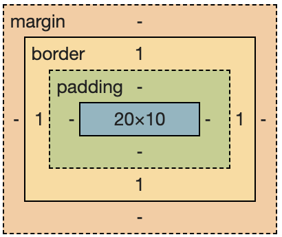

### BFC

#### 1. 布局规则

BFC是一个隔离的独立容器，容器里面的子元素不会影响外面的元素，反过来也一样

##### 1.1 BFC内的盒子均沿着垂直方向逐个排列

##### 1.2 BFC内盒子之间的垂直距离由margin属性决定，垂直方向上直接相邻的margin会发生塌陷/合并，并且以最大的margin值作为最终的margin值。

**父子关系**

``` html
  <div style="display:inline-block; border: 1px dotted red;">
    <div style="margin: 10px;">
       <div style="margin: 15px; width: 200px; height: 200px; background-color: red;"></div>
    </div>
  </div>
```
效果


**兄弟节点**

```html
  <div style="display:inline-block; border: 1px dotted red;">
    <div style="margin: 10px; width: 200px; height: 200px; background-color: red;"></div>
    <div style="margin: 20px; width: 200px; height: 200px; background-color: red;"></div>
  </div>
```
效果


**空元素**

```html
  <div style="display:inline-block; border: 1px dotted red;">
    <div style="margin: 10px;"></div>
  </div>
```
效果



##### 1.3 BFC内盒子的左外边缘都会接触包含块的左边缘(如果从右到左进行排版，那么右边发生接触)，即使存在浮动盒子也是如此

```html
<style>
    * {
        margin: 0;
        padding: 0;
    }
    .left {
        background: yellowgreen;    
        <!--这边加上透明色更好查看-->
        opacity: 0.5;
        width: 200px;
        height: 200px;
        <!--浮动创建BFC元素-->
        float: left;
    }
    .right {
        background: pink;
        width:400px;
        height: 100px;
    }
    .box {
        background: gray;
        height: 100%;
        margin-left: 50px;
    }
</style>
<div class="box">
    <div class="left">左边盒子</div>
    <div class="right">右边盒子</div>
</div>
```

效果


##### 1.4 BFC的内容不会与浮动元素发生重叠，且浮动元素也会参与BFC的高度计算

```html
 <style>
    .parent {
      border: 5px solid lightseagreen;
      width: 300px;
      <!-- bfc-->
      overflow: hidden;
    }

    .child {
      border: 5px solid lightsalmon;
      width: 100px;
      height: 100px;
      float: left;
    }
  </style>
  <body>
    <div class="parent">
      <div class="child"></div>
      <div class="child"></div>
    </div>
  </body>
```
效果


#### 2. 触发条件
* 1、float的值不是none。
* 2、position的值不是static或者relative。
* 3、display的值是inline-block、table-cell、flex、table-caption或者inline-flex
* 4、overflow的值不是visible

#### 3. 应用场景
* 1.利用BFC避免margin重叠。(Box垂直方向的距离由margin决定。属于同一个BFC的两个相邻Box的margin会发生重叠。)
* 2.自适应两栏布局。(BFC的区域不会与float box重叠。)

``` html
<div class="layout">
    <div class="aside">aside</div>
    <div class="main">main</div>
</div>
```

```css
.aside {
    float: left;
    width: 100px;
}
.main {
    <!-- 触发 BFC -->
    overflow: auto;
}
```


* 3.清除浮动（解决float高度塌陷）。(计算BFC的高度时，浮动元素也参与计算)

### 参考文档
[掘金](https://juejin.cn/post/6941206439624966152#heading-15)


