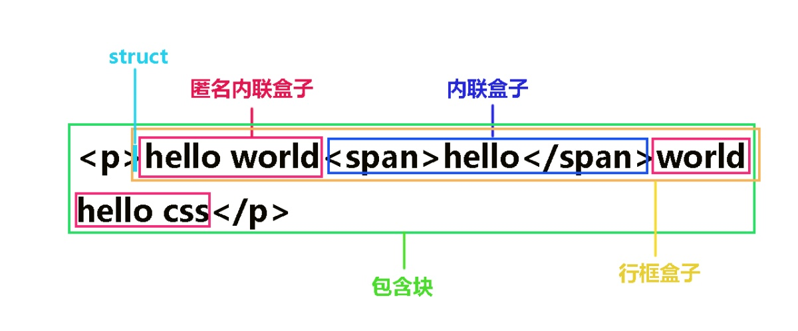
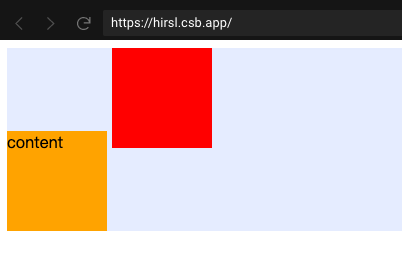
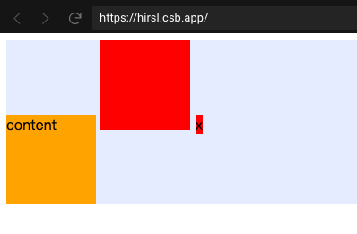

## IFC

### 1. 布局规则

* 盒子沿着水平方向逐个排列
* 只会计算盒子水平方向上的margin、border和padding，而不会计算垂直方向上的。
* 在垂直方向上，盒子有多种对齐方式(vertical-align)：可以top对齐，或者bottom对齐，也可以通过文本基线(baseline)对齐。
* 能把一行的盒子完全包含进去的方形区域，被称为行框(line box)。
* 行框的高度由CSS行高计算规则确定，而且同个IFC内的行框高度一般不同(行框内最高元素的高度可能不同)。
* 行框通常是左右边紧贴包含块，但会因为浮动元素的存在而发生变化。行框的宽由包含块和存在的浮动元素决定，浮动元素可能导致行框宽度变小。如果行框内所有盒子的总宽度小于行框的宽度，那行框内盒子的水平分布方式由text-align属性决定
* 如果一个行框无法容纳多个inline元素，那他们会被分布到两个或多个垂直堆叠的行框内
* 如果一个inline元素的宽度超过行框能容纳的宽度，那它会被切割成若干盒子然后跨行框分布，而且被切割处margins, borders, 和padding均不生效

### 2. 应用场景

**水平居中**
根据IFC的布局规则： 水平方向上，通过text-align改变对齐方式。

**垂直居中**
根据IFC的布局规则： 垂直方向上，通过vertical-align改变对齐方式。

### 3. 内联盒子模型



CSS 中的内联盒子模型可以分为以下几个部分
* 内容区域
* 内联盒子
  * 内联盒子，用\<span>、\<a>和\<em>等标签包裹的盒子。
  * 匿名内联盒子，直接写的文字部分。
* 行框盒子
* 包含盒子
* 幽灵空白节点(strut)

### 4. IFC内部元素排列规则

行内元素的对齐线，也就是垂直方向上的对齐方式，可以通过 vertical-align 进行控制。


* 水平垂直方向上的排列。
  * 内联元素在水平线上一个接一个排列，默认通过基线排列。
    * 如果行内元素能在一行装下，子元素的排列方式由 text-align 决定。
    * 如果行内元素不能在一行装下，默认此行内框会被分割，根据 white-space 决定。
  * 内部元素水平方向上的 margin、padding、border 有效，垂直方向上无效。
  * 垂直方向上有多种对齐方式: 顶部、底部、基线，根据 vertical-align 属性决定。
* line box 的计算规则。
  * line box 的宽度由包含其元素的宽度决定。
  * line box 的高度受当前行所有内联元素的高度影响，可能比内部最高的元素还要高（由基线对齐所导致）

### 5. line-height、font-size、height 三者的区别

进入[链接地址](https://segmentfault.com/a/1190000023717411)

### 6. vertical-align 各个属性的使用

进入[链接地址](https://www.cnblogs.com/hykun/p/3937852.html)

### 7. CSS 内联元素常见问题

#### 普通内联元素导致的图片间隙问题
```html
<div style="background-color:#e5edff;">
  
</div>
```

> 产生问题的原因

1. 普通的内联元素（非 inline-block 元素）的高度是由 line-height 直接决定的。
2. 默认的内联元素都是基线对齐，也就是字符 x 的下边缘。
3. 图片是一个 inline-block 元素，他的基线就是 margin box，也就是图片的下边缘。
4. 所以这里的图片就和 x 的下边缘对齐了。
5. 文本节点也是有高度的，并根据高度会产生行距，即上下间隙，所以就撑大了 div。


> 解决问题的方案

1. 将图片变成 block 元素，就不存在这个问题了。
2. 改变 vertical-align 对齐方式，如 top bottom middle 都可以。
3. 将 line-height 设置为为足够小，例如 0，这样文本的高度就为 0 就不会撑大 div 了。
4. 将font-size设置为为足够小，间接计算出的 line-height 就为 0 ，也就不会撑大 div 了。

#### inline-block 内联元素导致的对齐问题

```html
<div style="background-color:#e5edff">
  <div
    style="display:inline-block;width: 100px;height: 100px;background-color: orange"
  >
    content
  </div>
  <div
    style="display:inline-block;width: 100px;height: 100px;background-color: red"
  ></div>
</div>
```



> 产生问题的原因

1. 内联元素的排列方式，默认是按基线对齐。
2. 没有内容的 inline-block 元素的基线是 margin box 的底部，也就是方块的底部。
3. 有内容的 inline-block 元素的基线就是元素里面最后一行内联元素的基线。
4. 所以这里的 content 就和第二个盒子的底部对齐了，div 就被撑大了。



> 解决问题的方案

1. 给第二个盒子加一个空白节点，如：&nbsp。
2. 改变两个盒子的 vertical-align 对齐方式，如 top bottom middle 都可以（如果只改一个，也会出现问题 1 中的问题）

### 参考资料
[CSS 深入理解 vertical-align 和 line-height 的基友关系](https://www.zhangxinxu.com/wordpress/2015/08/css-deep-understand-vertical-align-and-line-height/)