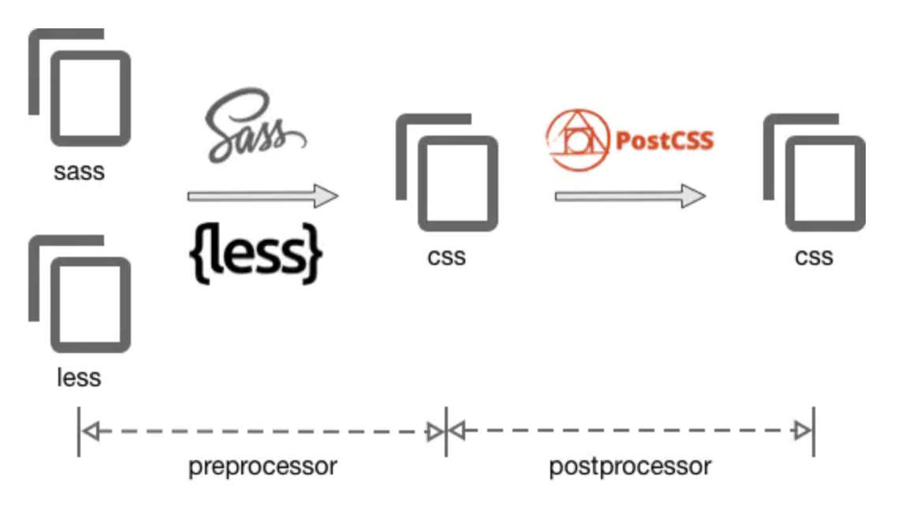

## postcss
---

postcss 一种对css编译的工具，类似babel对js的处理，常见的功能如：

1. 使用下一代css语法

2. 自动补全浏览器前缀

3. 自动把px代为转换成 rem

4. css 代码压缩等等

postcss 只是一个工具，本身不会对css一顿操作，它通过插件实现功能，autoprefixer 就是其一。

## 与预处理器的区别

PostCSS是什么？或许，你会认为它是预处理器、或者后处理器等等。其实，它什么都不是。它可以理解为一种插件系统,而且重要的一点是，postcss可以和less/sass结合使用



虽然可以结合less/sass使用，但是它们还是有很多重复功能，用其中一个基本就 ok 了

举个栗子：

为了简单的方式解释预处理和后处理的不同，这里以单位转换为例。当书写 Sass 时，我们可以用函数px转换成rem

**预处理器方案**
```css
.selector { margin-bottom: rem(20px); }

/*编译输出结果*/
.selector { margin-bottom: 1.25rem; }
```

**postcss方案**
```css
.selector { margin-bottom: 20px; }

/*编译输出结果*/
.selector { margin-bottom: 1.25rem; }
```

## 如何使用

这里只说在webpack里集成使用，首先需要 loader

1. 安装

```
cnpm install postcss-loader --save-dev
```

2. webpack配置

配合时注意loader的顺序（从下面开始加载）

```
rules: [
    {
        test: /\.css$/,
        exclude: /node_modules/,
        use: [
            {
                loader: 'style-loader',
            },
            {
                loader: 'css-loader',
            },
            {
                loader: 'postcss-loader'
            }
        ]
    }
]
```

3. postcss配置

项目根目录新建 postcss.config.js 文件，所有使用到的插件都需在这里配置(也可以在webpack中配置)

```
module.exports = {
  plugins: {
    'autoprefixer': {
        browsers: '> 5%' //可以都不填，用默认配置
    }
  }
}
```

## 常用的postcss插件

* autoprefixer 前缀补全，全自动的

* postcss-cssnext 使用下个版本的css语法

* postcss-pxtorem 把px转换成rem