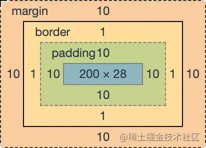
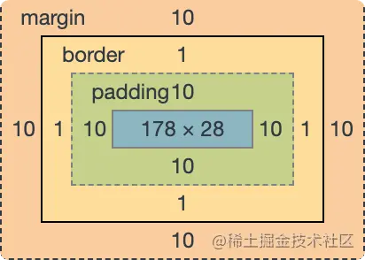

## 视觉格式化模型

### 盒子模型

在 CSS 中任何元素都可以看成是一个盒子，而一个盒子是由 4 部分组成的：内容（content）、内边距（padding）、边框（border）和外边距（margin）

盒模型有 2 种：标准盒模型和 IE 盒模型，本别是由 W3C 和 IExplore 制定的标准。

如果给某个元素设置如下样式：

```css
.box {
    width: 200px;
    height: 200px;
    padding: 10px;
    border: 1px solid #ccc;
    margin: 10px;
}
```

标准盒模型认为：盒子的实际尺寸 = 内容（设置的宽/高） + 内边距 + 边框




IE 盒模型认为：盒子的实际尺寸 = 设置的宽/高 = 内容 + 内边距 + 边框



在 CSS3 中新增了一个属性 box-sizing，允许开发者来指定盒子使用什么标准，它有 2 个值：

* content-box：标准盒模型；
* border-box：IE 盒模型；

### 盒子类型

盒子类型由display属性决定，同时给一个元素设置 display 后，将会决定这个盒子的 2 个显示类型

* outer display type（对外显示）：决定了该元素本身是如何布局的，即参与何种格式化上下文；
* inner display type（对内显示）：其实就相当于把该元素当成了容器，规定了其内部子元素是如何布局的，参与何种格式化上下文；

#### 对外显示

对外显示方面，盒子类型可以分成以下2类：

* 块级盒子：display 为 block、list-item、table、flex、grid、flow-root 等；
* 行内级盒子：display 为 inline、inline-block、inline-table 等；

所有块级盒子都会参与**BFC**，呈现垂直排列；而所有行内级盒子都参会**IFC**，呈现水平排列。

具体的区别如下：

* block

占满一行，默认继承父元素的宽度；多个块元素将从上到下进行排列；
设置 width/height 将会生效；
设置 padding 和 margin 将会生效；

* inline

不会占满一行，宽度随着内容而变化；多个 inline 元素将按照从左到右的顺序在一行里排列显示，如果一行显示不下，则自动换行；
设置 width/height 将不会生效；
设置竖直方向上的 padding 和 margin 将不会生效；

* inline-block

是行内块元素，不单独占满一行，可以看成是能够在一行里进行左右排列的块元素；
设置 width/height 将会生效；
设置 padding 和 margin 将会生效；

#### 对内显示

对内方面，其实就是把元素当成了容器，里面包裹着文本或者其他子元素。container box 的类型依据 display 的值不同，分为 4 种：

* block container：建立 BFC 或者 IFC；
* flex container：建立 FFC；
* grid container：建立 GFC;
