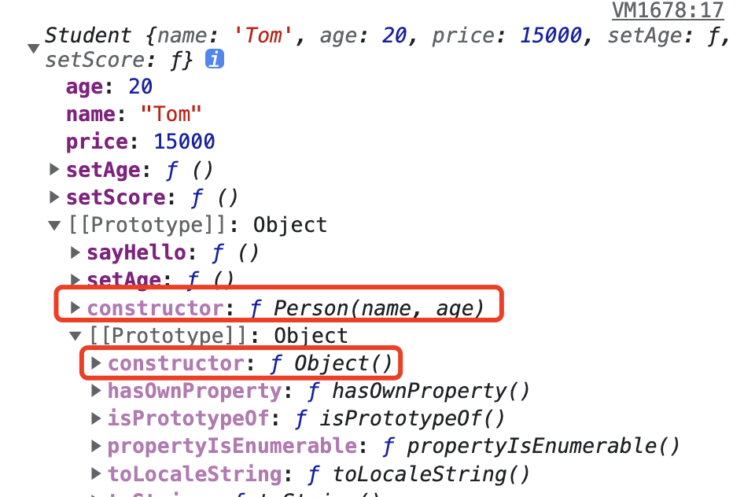
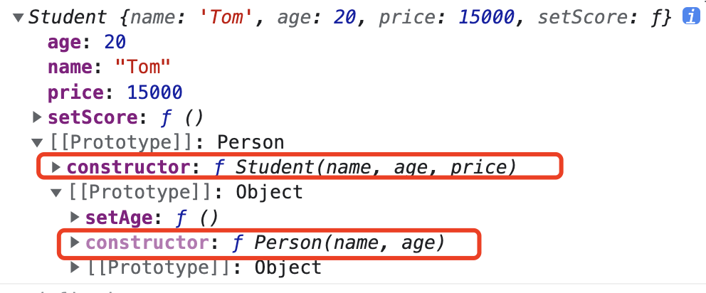

## JavaScript常见的六种继承方式

面向对象编程很重要的一个方面，就是对象的继承。A 对象通过继承 B 对象，就能直接拥有 B 对象的所有属性和方法。这对于代码的复用是非常有用的,js中常用的继承有以下几种方案：

### 方式一、原型链继承

```js
//父类型
function Person(name, age) {
    this.name = name,
    this.age = age,
    this.play = [1, 2, 3]
    this.setName = function () { }
}
Person.prototype.setAge = function () { }
//子类型
function Student(price) {
    this.price = price
    this.setScore = function () { }
}
Student.prototype = new Person() // 子类型的原型为父类型的一个实例对象
var s1 = new Student(15000)
var s2 = new Student(14000)
console.log(s1,s2)

 s1.play.push(4)
console.log(s1.play, s2.play)//s1、s2共享play属性，play引用类型互相影响
console.log(s1.__proto__ === s2.__proto__)//true
console.log(s1.__proto__.__proto__ === s2.__proto__.__proto__)//true
```

由于Student.prototype = new Person()，所以所有Student实例调用的是同个Person实例，没能很好的做到数据隔离

**优点：**

* 父类新增原型方法/原型属性，子类都能访问到
* 简单，易于实现

**缺点：**

* 无法实现多继承
* 来自原型对象的所有属性被所有实例共享
* 创建子类实例时，无法向父类构造函数传参
* 要想为子类新增属性和方法，必须要在Student.prototype = new Person() 之后执行，不能放到构造器中

### 方式二、借用构造函数继承

```js
function Person(name, age) {
  this.name = name,
  this.age = age,
  this.play = [1, 2, 3]
  this.setName = function () {}
}
Person.prototype.setAge = function () {}
function Student(name, age, price) {
  Person.call(this, name, age)  // 相当于: this.Person(name, age)
  /*this.name = name
  this.age = age*/
  this.price = price
}
var s1 = new Student('Tom', 20, 15000)
var s2 = new Student('Tom2', 20, 15000)
s1.play.push(4)//s1的play变化，并不会影响到s2的play
console.log(s1.setAge())//Uncaught TypeError: s1.setAge is not a function
```

由于Person.call(this, name, age)调用，虽然做到了数据隔离，但并没有将Person进行实例化或直接原型指派，故s1无法访问到Person.prototype.setAge

**优点：**

* 解决了原型链继承中子类实例共享父类引用属性的问题
* 创建子类实例时，可以向父类传递参数
* 可以实现多继承(call多个父类对象)

**缺点：**

* 实例并不是父类的实例，只是子类的实例
* 只能继承父类的实例属性和方法，不能继承原型属性和方法
* 无法实现函数复用，每个子类都有父类实例函数的副本，影响性能

### 方式三、原型链+借用构造函数的组合继承

```js
function Person(name, age) {
    this.name = name,
    this.age = age,
    this.setAge = function () { }
}
Person.prototype.setAge = function () {
    console.log("111")
}
function Student(name, age, price) {
    Person.call(this,name,age)
    this.price = price
    this.setScore = function () { }
}
Student.prototype = new Person()
Student.prototype.constructor = Student//组合继承也是需要修复构造函数指向的
Student.prototype.sayHello = function () { }
var s1 = new Student('Tom', 20, 15000)
var s2 = new Student('Jack', 22, 14000)
console.log(s1)
console.log(s1.constructor) //Student
console.log(p1.constructor) //Person
```
Person.call(this,name,age)调用过一次Person构造函数，Student.prototype = new Person()又调用了一次Person构造函数

**优点：**

* 可以继承实例属性/方法，也可以继承原型属性/方法
* 不存在引用属性共享问题
* 可传参
* 函数可复用

**缺点：**

* 调用了两次父类构造函数，生成了两份实例

### 方式四、组合继承优化1

```js
function Person(name, age) {
    this.name = name,
        this.age = age,
        this.setAge = function () { }
}
Person.prototype.setAge = function () {
    console.log("111")
}
function Student(name, age, price) {
    Person.call(this, name, age)
    this.price = price
    this.setScore = function () { }
}
Student.prototype = Person.prototype
Student.prototype.constructor = Student//这句话加不加都不影响下面instanceof结果
Student.prototype.sayHello = function () { }
var s1 = new Student('Tom', 20, 15000)
console.log(s1)
console.log(s1 instanceof Student, s1 instanceof Person)//true true
console.log(s1.constructor)//Person
```
虽然解决了两次实例化的问题

由于Student.prototype = Person.prototype 
所以s1.__proto__===Person.prototype
等于s1.__proto__===Student.prototype
所以s1是Student也是Person的实例



**优点：**

* 不会初始化两次实例方法/属性，避免的组合继承的缺点

**缺点：**

* 没办法辨别是实例是子类还是父类创造的，子类和父类的构造函数指向是同一个。

### 方式五、 组合继承优化2

```js
function Person(name, age) {
    this.name = name,
    this.age = age
}
Person.prototype.setAge = function () {
    console.log("111")
}
function Student(name, age, price) {
    Person.call(this, name, age)
    this.price = price
    this.setScore = function () {}
}
Student.prototype = Object.create(Person.prototype)//核心代码
Student.prototype.constructor = Student//核心代码
var s1 = new Student('Tom', 20, 15000)
console.log(s1 instanceof Student, s1 instanceof Person) // true true
console.log(s1.constructor) //Student
console.log(s1)
```
核心API，不懂的可以点[这里](/src/js/fun源码实现?id=objectcreate实现)查看API的实现



Student继承了所有的Person原型对象的属性和方法。目前来说，最完美的继承方法！

### 方式六、ES6中class 的继承

```js
class Person {
  //调用类的构造方法
  constructor(name, age) {
      this.name = name
      this.age = age
  }
  //定义一般的方法
  showName() {
      console.log("调用父类的方法")
      console.log(this.name, this.age);
  }
}
let p1 = new  Person('kobe', 39)
console.log(p1)
//定义一个子类
class Student extends Person {
  constructor(name, age, salary) {
      super(name, age)//通过super调用父类的构造方法
      this.salary = salary
  }
  showName() {//在子类自身定义方法
      console.log("调用子类的方法")
      console.log(this.name, this.age, this.salary);
  }
}
let s1 = new Student('wade', 38, 1000000000)
console.log(s1)
s1.showName()
```

**优点：**

* 语法简单易懂,操作更方便

**缺点：**

* 并不是所有的浏览器都支持class关键字