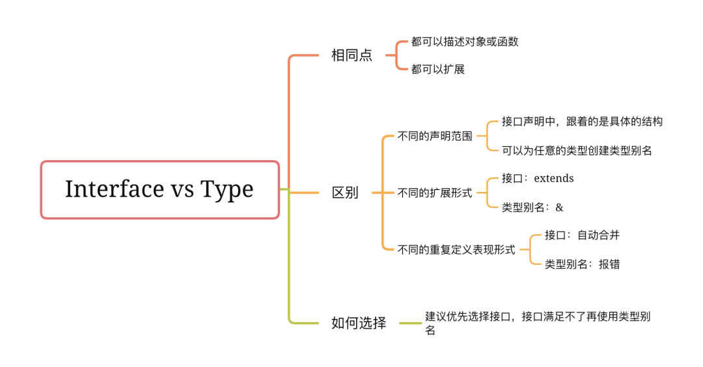

## type和interface的区别


### 相同点：

* 都可以描述对象或函数
```
// 接口 
interface Sister { 
  name: string; 
  age: number; 
} 
 
interface SetSister { 
  (name: string, age: number): void; 
} 
 
// 类型别名 
type Sister = { 
  name: string; 
  age: number; 
}; 
 
type SetSister = (name: string, age: number) => void; 
```
* 都可以扩展
```
// 接口 
interface SisterAn { 
    name: string; 
} 
 
// 类型别名 
type SisterRan = { 
    age: number; 
} 
// 接口扩展接口 
interface Sister extends SisterAn { 
    age: number; 
}
// 类型别名扩展类型别名 
type SisterPro = SisterRan & { 
    name: string; 
} 
```

### 区别
* 不同的声明范围
与接口不同，可以为任意的类型创建类型别名

类型别名的右边可以是任何类型，包括基本类型、元祖、类型表达式( & 或 | 等);而在接口声明中，右边必须为变量结构。例如，下面的类型别名就不能转换成接口

```
type Name = string 
type Text = string | { text: string }; 
type Coordinates = [number, number]; 
```
* 不同的扩展形式
接口是通过继承的方式来扩展，类型别名是通过 & 来扩展
```
// 接口扩展 
interface SisterAn { 
    name: string; 
} 
interface Sister extends SisterAn { 
    age: number; 
} 
 
// 类型别名扩展 
type SisterRan = { 
    age: number; 
} 
type SisterPro = SisterRan & { 
    name: string; 
} 
```
* 不同的重复定义表现形式
接口可以定义多次，多次的声明会自动合并
```
interface Sister { 
    name: string; 
} 
interface Sister { 
    age: number; 
} 
 
const sisterAn: Sister = { 
    name: 'sisterAn' 
}  
// 报错：Property 'age' is missing in type '{ name: string; }' but required in type 'Sister' 
 
const sisterRan: Sister = { 
    name: 'sisterRan',  
    age: 12 
} 
// 正确 
```
但是类型别名如果定义多次，会报错
```
type Sister = { // Duplicate identifier 'Sister' 
    name: string; 
} 
 
type Sister = { // Duplicate identifier 'Sister' 
    age: number; 
} 
```
