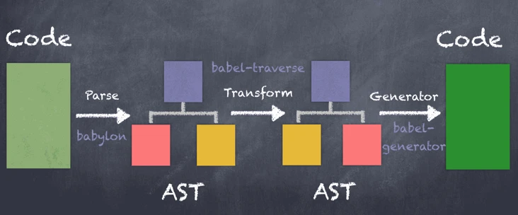

# 1.Babel是什么？

Babel是一个工具集，主要用于将ES6版本的JavaScript代码转为ES5等向后兼容的JS代码，从而可以运行在低版本浏览器或其它环境中

总体来说，Babel的主要工作有两部分：

* 语法转换
 
  `` 把ES6的箭头函数语法转换成了ES5的函数定义语法。 箭头函数语法、async函数语法、class定义类语法和解构赋值等等都是ES6新增的语法。
  ``

* 补齐API

  `` 
  通过 Polyfill 的方式在目标环境中添加缺失的特性
  ``

举个栗子：

转换前：
```js
var fn = (num) => num + 2;
var promise = Promise.resolve('ok')
```

转换后：
```js
var fn = function fn(num) {
  return num + 2;
};
var promise = Promise.resolve('ok');
```

观察转换后代码，可以发现Babel仅对箭头函数进行转换但并没有对ES6的Promise进行转换，在旧的浏览器环境下，会报错Promise is not defined

Babel默认只转换新的JavaScript语法（syntax），而不转换新的 API,所以需要一个为当前环境提供垫片，最常规的做法是使用polyfill

# 2. 如何使用

> 1. 一个完整的Babel转码工程通常包括如下：

* Babel配置文件
* Babel相关的npm包
* 需要转码的JS文件

> 2. 执行命令，进行转码：

```js
 npx babel main.js -o compiled.js
```

就是这么简单，就完成了文件转码，但更多的是使用webpack工程化编译


# 3.关于Babel版本

* Babel7的npm包都是放在babel域下的，即在安装npm包的时候，我们是安装@babel/这种方式，例如@babel/cli、@babel/core等。

* Babel6，我们安装的包名是babel-cli，babel-core等

# 4.配置文件

babel.config.js

.babelrc

package.json

```plain
  {
    "presets": [
      "@babel/env"
    ],
    "plugins": [
      "@babel/plugin-transform-runtime"
    ]
  }
```
# 5.插件与预设

plugin代表插件，preset代表预设，它们分别放在plugins和presets，每个插件或预设都是一个npm包

Babel插件的数量非常多

预设是一组Babel插件的集合，用大白话说就是插件包

虽然Babel7官方有90多个插件，不过大半已经整合在@babel/preset-env和@babel/preset-react等预设里了，我们在开发的时候直接使用预设就可以了。

目前比较常用的插件只有@babel/plugin-transform-runtime。

# 6.webpack中使用babel

babel-loader
babel-loader是用于webpack的一个loader，以便webpack在构建的时候用Babel对JS代码进行转译，这样我们就不用再通过命令行手动转译了。我们在配置该loader的时候需要先安装它

```js
npm install babel-loader
```

在webpack配置文件中，我们把babel-loader添加到module的loaders列表中：

```js
module: {
    rules: [
      {
        test: /\.js$/,
        exclude: /(node_modules)/,
        use: {
          loader: 'babel-loader',
          options: {
            presets: ['@babel/preset-env']
          }
        }
      }
    ]
}
```

我们通过options属性给babel-loader传递预设和插件等Babel配置项。我们也可以省略这个options，这个时候babel-loader会去读取默认的Babel配置文件，也就是.babelrc，.babelrc.js，babel.config.js等。在现在的前端开发中，建议通过配置文件来传递这些配置项。

# 7.常用npm包

* @babel/cli是Babel命令行转码工具，如果我们使用命令行进行Babel转码就需要安装它。
* @babel/cli依赖@babel/core，因此也需要安装@babel/core这个Babel核心npm包。
* @babel/preset-env这个npm包提供了ES6转换ES5的语法转换规则，我们在Babel配置文件里指定使用它。如果不使用的话，也可以完成转码，但转码后的代码仍然是ES6的，相当于没有转码。
* @babel/polyfill 转换新的 API,使用babel-polyfill需要额外安装babel-polyfill依赖包， 然后在webpack配置文件中的入口或者公共模块中加入’babel-polyfill’即可 
* @babel/runtime  解决了Babel不转换新API的问题，但是直接在代码中插入帮助函数，会导致污染了全局环境，并且不同的代码文件中包含重复的代码，导致编译后的代码体积变大


# 8. 插件开发



想要开发的小伙伴，快点[点击进入学习](https://www.vanadis.cn/2017/10/22/how-to-write-a-babel-plugin/)吧


# 9. AST抽象语法树

babel转码需要经过三个阶段：parse，transform，generate，顾名思义，不赘述。顺便也介绍一下babel的这几个工具

* @babel/parser
* @babel/traverse
* @babel/types
* @babel/generator

### @babel/parser
[parse](https://github.com/jamiebuilds/babel-handbook/blob/master/translations/en/plugin-handbook.md#parse)阶段会进行词法分析（Lexical Analysis）和语法分析（Syntactic Analysis），里面会将code解析成各种token，最终将code解析成ast语法树。不了解概念也无妨，我们是API工程师。

[@babel/parser](https://babel.docschina.org/docs/en/babel-parser)（前身是babel v6.x版的[babylon](https://github.com/babel/babylon/blob/master/ast/spec.md)）是一个可以将JS代码转成AST的解析器。

babelParser.parse(code, [options])，将js转成ast，options见官网，可以配置一些例如从第几行开始解析，是否允许import/export等，也可以配置jsx，flow等plugin。

### @babel/traverse

[transform](https://github.com/jamiebuilds/babel-handbook/blob/master/translations/en/plugin-handbook.md#transform)阶段，会将ast语法树，增加/更新/删除节点，生成新的ast语法数。

[@babel/traverse](https://babel.docschina.org/docs/en/babel-traverse)用于改变ast语法树的节点。

### @babel/types

[@babel/types](https://babel.docschina.org/docs/en/babel-types)是一个操作astT节点的lodash式函数库。用于构建，验证，转换ast节点。支持的API非常多，有两类isXXX，assertXXX比较常用（均支持传递第二个参数options，用来判断node节点里是否含有该属性）。这里用的removeComments居然在官网里没有…实际你打印出来，@babel/types里是有该方法的。

### @babel-generator

[generator](https://github.com/jamiebuilds/babel-handbook/blob/master/translations/en/plugin-handbook.md#generate)阶段，根据最终的ast语法树生成code。

[@babel-generator](https://babel.docschina.org/docs/en/babel-generator)用于将ast转为js代码。

# 10.附录

babel官方文档：[进入查看](https://babel.docschina.org/)

在线将代码转换成 AST 树结构的工具：[进入查看](https://astexplorer.net/)

插件开发手册：[进入查看](https://github.com/jamiebuilds/babel-handbook/blob/master/translations/zh-Hans/plugin-handbook.md)

babel使用手册：[进入查看](https://github.com/jamiebuilds/babel-handbook/blob/master/translations/zh-Hans/user-handbook.md)


