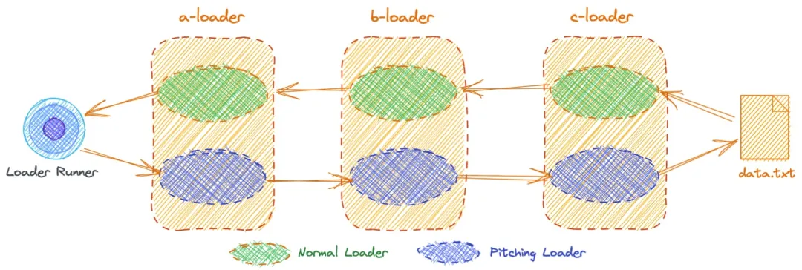
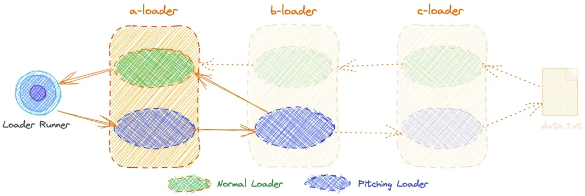

## Webpack Loader

> 作用

Loader(加载器) 是 webpack 的核心之一。它用于将不同类型的文件转换为 webpack 可识别的模块

> 工作原理

webpack 只能直接处理 javascript 格式的代码。任何非 js 文件都必须被预先处理转换为 js 代码，才可以参与打包。loader（加载器）就是这样一个代码转换器。它由 webpack 的 `loader runner` 执行调用，接收原始资源数据作为参数（当多个加载器联合使用时，上一个loader的结果会传入下一个loader），最终输出 javascript 代码（和可选的 source map）给 webpack 做进一步编译。

> 执行顺序

* 分类(通过 rule 对象的 enforce 属性来指定)
  * pre： 前置loader
  * normal： 普通loader
  * inline： 内联loader
  * post： 后置loader

配置如下:

```js
{ 
  test: /\.js$/i, 
  use: ["a-loader"], 
  enforce: "post", // post loader 
}

```

* 执行优先级
  * 4类 loader 的执行优级为：`pre > normal > inline > post` 。
  * 相同优先级的 loader 执行顺序为：`从右到左，从下到上`。

举个常用栗子：

```js
//webpack.config.js
module: {
  rules: [
    {
      test: /\.scss|\.css/,
      use: [
        'style-loader',
        'css-loader',
        'postcss-loader',
        'sass-loader'
      ]
    }
  ]
}
```

对于scss文件，按如上配置，那么它的执行顺序是sass-loader -> postcss-loader -> css-loader -> style-loader

* 执行阶段
 * normal阶段: loader 上的 常规方法，按照 前置(pre)、普通(normal)、行内(inline)、后置(post) 的顺序调用。模块源码的转换， 发生在这个阶段。
 * pitch阶段 :loader 上的 pitch 方法，按照 后置(post)、行内(inline)、普通(normal)、前置(pre) 的顺序调用。

## 如何开发

loader 是一个导出一个函数的 node 模块。

当只有一个 loader 应用于资源文件时，它接收源码作为参数，输出转换后的 js 代码

```js
//hello-loader.js
module.exports = function loader (source) {
    console.log('hello loader');
    return source;
}
```
然后使用loader，只需要在你的 webpack 配置的 rules 数组中添加loader：
```js
// webpack.config.js
const path = require('path');
module.exports = {
  entry: {...},
  output: {...},
  module: {
    rules: [
      {
        test: /\.js$/,
        // 直接指明 loader 的绝对路径
        use: path.resolve(__dirname, 'loaders/hello-loader')
      }
    ]
  }
}
```
这就是一个最简单的 loader 了，这个 loader 啥也没干，就是接收源码，然后原样返回，为了证明这个loader被调用了，我在里面打印了一句话‘hello loader’。

## pitch loader 与 normal loader

关于normal loader本质上就是loader函数本身

```js
// loader函数本身 我们称之为loader的normal阶段
function loader(source) {
    // dosomething
    return source
}
```

关于pitch loader就是normal loader上的一个pitch属性，它同样是一个函数:

```js
// pitch loader是normal上的一个属性
loader.pitch = function (remainingRequest,previousRequest,data) {
    // ...
}
```

简单来说这就是pitch loader和normal loader。

我们将loader的pitch属性称为loader的pitch loader。

自然而然，我们将loader函数本身称为noram loader。

以下是loader两个阶段的执行顺序



看个栗子：

我们根据以下目录结构来添加对应的目录和文件：

```js
├── dist # 打包输出目录 
│   └── index.html 
├── loaders # loaders文件夹 
│   ├── a-loader.js 
│   ├── b-loader.js 
│   └── c-loader.js 
├── node_modules 
├── package-lock.json 
├── package.json 
├── src # 源码目录 
│   ├── data.txt # 数据文件 
│   └── index.js # 入口文件 
└── webpack.config.js # webpack配置文件 
```

dist/index.html

```html
<!DOCTYPE html> 
<html lang="zh-cn"> 
<head> 
    <meta charset="UTF-8"> 
    <meta http-equiv="X-UA-Compatible" content="IE=edge"> 
    <meta name="viewport" content="width=device-width, initial-scale=1.0"> 
    <title>Webpack Loader 示例</title> 
</head> 
<body> 
    <h3>Webpack Loader 示例</h3> 
    <p id="message"></p> 
    <script src="./bundle.js"></script> 
</body> 
</html> 
```

src/index.js

```js
import Data from "./data.txt" 
 
const msgElement = document.querySelector("#message"); 
msgElement.innerText = Data; 
```

src/data.txt

```js
大家好
```

webpack.config.js

```js
module.exports = { 
  entry: "./src/index.js", 
  output: { 
    filename: "bundle.js", 
    path: path.resolve(__dirname, "dist"), 
  }, 
  mode: "development", 
  module: { 
    rules: [ 
      { 
        test: /\.txt$/i, 
        use: ["a-loader", "b-loader", "c-loader"], 
      }, 
    ], 
  }, 
  resolveLoader: { 
    modules: [ 
      path.resolve(__dirname, "node_modules"), 
      path.resolve(__dirname, "loaders"), 
    ], 
  }, 
};
```

loaders/a-loader.js

```js
function aLoader(content, map, meta) { 
  console.log("开始执行aLoader Normal Loader"); 
  content += "aLoader]"; 
  return `module.exports = '${content}'`; 
} 
 
aLoader.pitch = function (remainingRequest, precedingRequest, data) { 
  console.log("开始执行aLoader Pitching Loader"); 
  console.log(remainingRequest, precedingRequest, data) 
}; 
 
module.exports = aLoader; 
```

loaders/b-loader.js

```js
function bLoader(content, map, meta) { 
  console.log("开始执行bLoader Normal Loader"); 
  return content + "bLoader->"; 
} 
 
bLoader.pitch = function (remainingRequest, precedingRequest, data) { 
  console.log("开始执行bLoader Pitching Loader"); 
  console.log(remainingRequest, precedingRequest, data); 
}; 
module.exports = bLoader; 
```

loaders/c-loader.js

```js
function cLoader(content, map, meta) { 
  console.log("开始执行cLoader Normal Loader"); 
  return content + "[cLoader->"; 
} 
cLoader.pitch = function (remainingRequest, precedingRequest, data) { 
  console.log("开始执行cLoader Pitching Loader"); 
  console.log(remainingRequest, precedingRequest, data); 
}; 
module.exports = cLoader; 
```

到这里，当在项目的根目录执行 npx webpack 命令时候，控制台出现以下内容

```js
开始执行aLoader Pitching Loader 
... 
开始执行bLoader Pitching Loader 
... 
开始执行cLoader Pitching Loader 
... 
开始执行cLoader Normal Loader 
开始执行bLoader Normal Loader 
开始执行aLoader Normal Loader 
```

很明显对于我们的示例来说，Pitching Loader 的执行顺序是 从左到右，而 Normal Loader 的执行顺序是 从右到左。

需要特别注意的是，pitching Loader 除了可以提前运行之外,当某个 Pitching Loader 返回非 undefined 值时，就会实现熔断效果,这里我们更新一下 bLoader.pitch 方法，让它返回 "bLoader Pitching Loader->" 字符串：

```js
bLoader.pitch = function (remainingRequest, precedingRequest, data) { 
  console.log("开始执行bLoader Pitching Loader"); 
  return "bLoader Pitching Loader->"; 
}; 
```

然后我们再次执行 npx webpack 命令之后，控制台会输出以下内容：

```js
开始执行aLoader Pitching Loader 
开始执行bLoader Pitching Loader 
开始执行aLoader Normal Loader 
asset bundle.js 4.53 KiB [compared for emit] (name: main) 
runtime modules 937 bytes 4 modules 
```

由以上输出结果可知，当 bLoader.pitch 方法返回非 undefined 值时，跳过了剩下的 loader。具体执行流程如下图所示：



## 参考链接

* [多图详解，一次性搞懂Webpack Loader](https://developer.51cto.com/article/677622.html)
* [你不知道的「pitch loader」应用场景](https://juejin.cn/post/7037696103973650463#heading-5)
