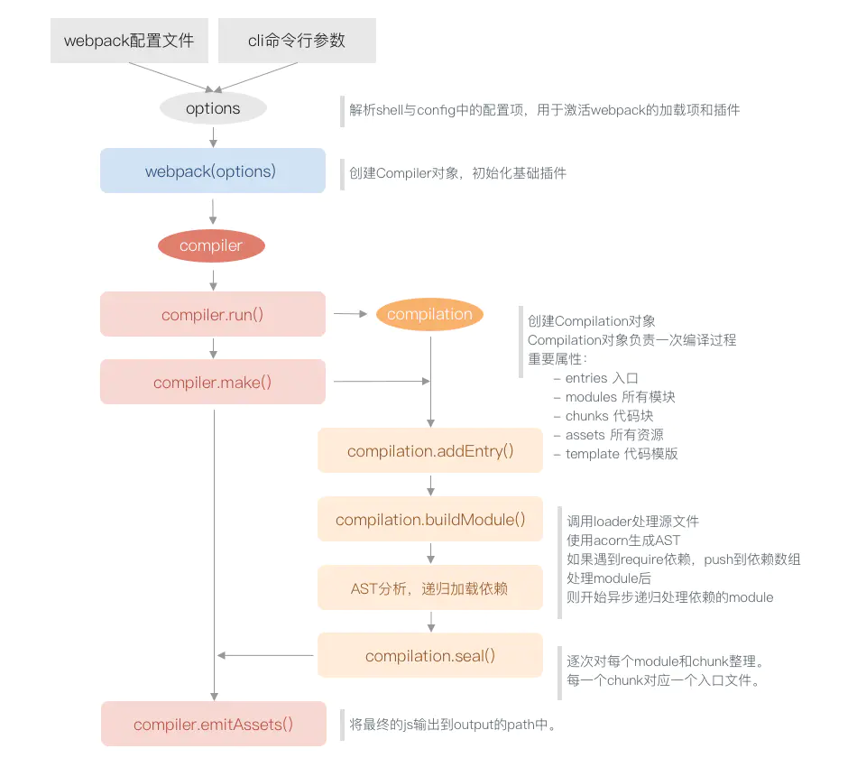

## plugin插件

> 作用

通过插件我们可以扩展 webpack，加入自定义的构建行为，使 webpack 可以执行更广泛的任务，拥有更强的构建能力。

> 工作原理

webpack 在编译代码过程中，会触发一系列Tapable钩子事件，插件所做的，就是找到相应的钩子，往上面挂上自己的任务，也就是注册事件，这样，当 webpack 构建的时候，插件注册的事件就会随着钩子的触发而执行了

> 底层逻辑

一次完整的 webpack 打包大致是这样的过程：

* 将命令行参数与 webpack 配置文件 合并、解析得到参数对象。
* 参数对象传给 webpack 执行得到 Compiler 对象。
* 执行 Compiler 的 run方法开始编译。每次执行 run 编译都会生成一个 Compilation 对象。
* 触发 Compiler 的 make方法分析入口文件，调用 compilation 的 buildModule 方法创建主模块对象。
* 生成入口文件 AST(抽象语法树)，通过 AST 分析和递归加载依赖模块。
* 所有模块分析完成后，执行 compilation 的 seal 方法对每个 chunk 进行整理、优化、封装。
* 最后执行 Compiler 的 emitAssets 方法把生成的文件输出到 output 的目录中。

webpack 底层基本流程图



> 钩子事件

上面说了，webpack 在编译代码过程中，会触发一系列Tapable钩子事件，那么有哪些钩子事件呢？

* Tapable
* Compiler Hooks
* Compilation Hooks
* JavascriptParser Hooks
* 更多可以[查看官网](https://webpack.docschina.org/api/plugins/)

## 如何开发


> 基本结构

* 一个命名的 Javascript 方法或者 JavaScript 类。
* 它的原型上需要定义一个叫做 apply 的方法。
* 注册一个事件钩子。
* 操作webpack内部实例特定数据。
* 功能完成后，调用webpack提供的回调。

一个插件结构如下

```js
class HelloWorldPlugin {
  apply(compiler) {
    compiler.hooks.done.tap(
      'Hello World Plugin',
      (
        stats /* 绑定 done 钩子后，stats 会作为参数传入。 */
      ) => {
        console.log('Hello World!');
      }
    );
  }
}

module.exports = HelloWorldPlugin;
```

然后，要安装这个插件，只需要在你的 webpack 配置的 plugin 数组中添加一个实例：

```js
// webpack.config.js
var HelloWorldPlugin = require('hello-world');

module.exports = {
  // ... 这里是其他配置 ...
  plugins: [new HelloWorldPlugin({ options: true })],
};
```

最简单的 webpack 插件到这就开发完毕了，这个插件会在每次打包结束，向控制台首先输出 Hello World!

## 参考链接

* [webpack](https://webpack.docschina.org/contribute/writing-a-plugin/)
* [揭秘webpack plugin](https://www.jianshu.com/p/8e92f36e52da)
