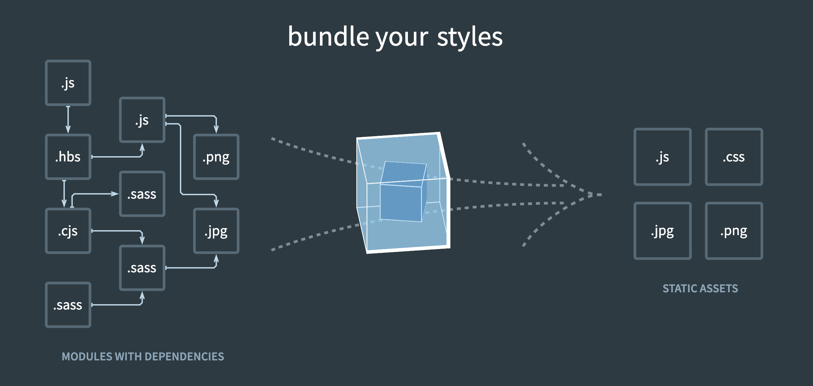
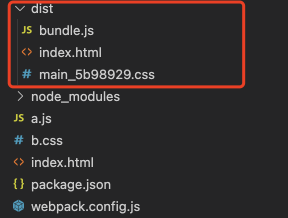
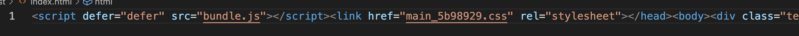
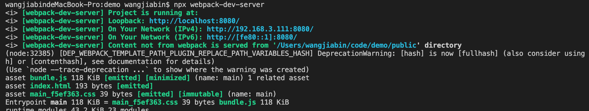
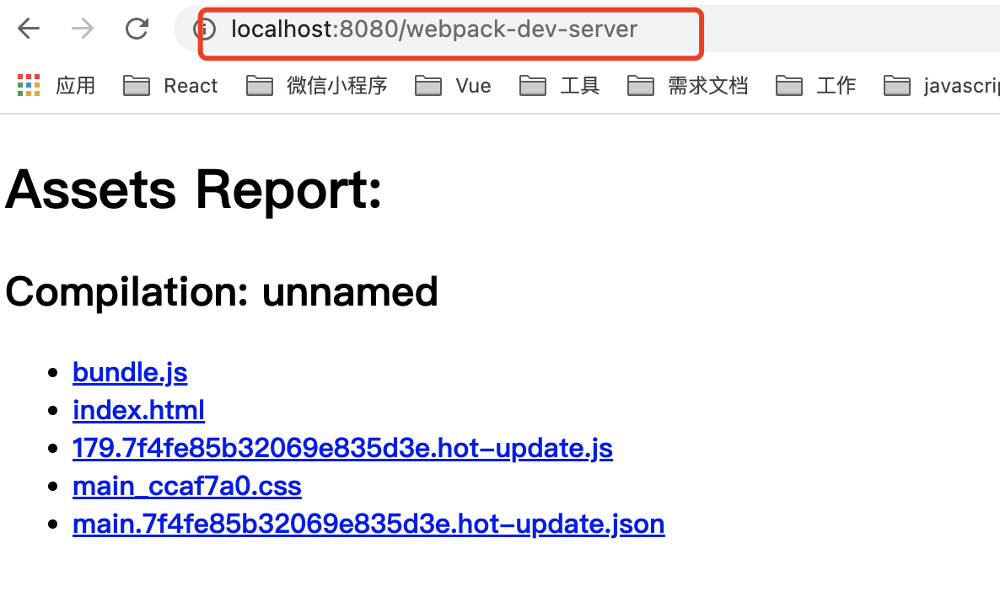

## 1.Webpack是什么

Webpack是一个模块打包工具，因为平常多用来对前端工程打包，所以也是一个前端构建工具。其最主要的功能就是模块打包

模块打包，通俗地说就是：找出模块之间的依赖关系，按照一定的规则把这些模块组织合并为一个JavaScript文件

Webpack认为一切都是模块，JS文件、CSS文件、jpg/png图片等等都是模块。Webpack会把所有的这些模块都合并为一个JS文件，这是它最本质的工作。当然，我们可能并不想要它把这些合并成一个JS文件，这个时候我们可以通过一些规则或工具来改变它。



想知道怎么使用webpack，那么安装一下的步骤，一步步来吧

## 2.快速使用

webpack 安装 

```js
  npm install --save-dev webpack@4.43.0    webpack-cli@3.3.12   
```

组织以下目录结构

```
├── node_modules
├── a.js
├── b.js
├── index.html
├── package.json
```
a.js

```js
  import { name } from './b.js';  
  console.log(name);
```

b.js

```js
  export var name = 'wangjiabin';
```

> 1. 命令行打包

```js
 npx webpack a.js -o bundle.js   
```

> 2. webpack配置文件

根目录新建webpack.config.js

```
├── node_modules
├── a.js
├── b.js
├── index.html
├── webpack.config.js
├── package.json
```

webpack.config.js：

```js
 var path = require('path');  
  module.exports = {
    entry: './a.js',
    output: {
      path: path.resolve(__dirname, ''),
      filename: 'bundle.js'
    }
  };
```
接下来执行

```js
 npx webpack  
```

通过以上方式，就能轻松打包出bundle.js文件了

## 3. loader使用

由于webpack自身只支持对JS文件处理，如果你引入了一个CSS文件或图片文件，那么webpack在处理该模块的时候解析失败,会在控制台报错,此时我们需要合适的loader进行进行转换

举个栗子：

```js
├── node_modules
├── a.js
├── b.css
├── index.html
├── webpack.config.js
├── package.json
```

a.js

```js
import './b.css'
```

b.css

```
.test {
  width: 30px;
  color: red;
}
```

index.html

```html
<!DOCTYPE html>
<html lang="en">
<head>
  <script src="bundle.js"></script>
</head>
<body>
  <div class="test">hello world</div>
</body>
</html>
```

安装loader

```js
 npm install css-loader style-loader
```

webpack.config.js

```js
const path = require('path');
module.exports = {
  entry: './a.js',
  output: {
    path: path.resolve(__dirname, ''),
    filename: 'bundle.js'
  },
  module: {
    rules: [{
      test: /\.css$/,
      use: ['style-loader', 'css-loader']
    }]
  }
};
```

最后执行npx webpack来完成打包，然后在浏览器打开index.html，发现CSS生效了

当然除了以上关于css的loader，项目中我们还需要更多的loader，如ts-loader、babel-loader等等

## 4. plugin的使用

插件目的在于解决 loader 无法实现的其他事，如打包优化，资源管理，注入环境变量等

依赖安装

```js
npm install --save-dev clean-webpack-plugin mini-css-extract-plugin html-webpack-plugin
```

* clean-webpack-plugin 清除文件
* mini-css-extract-plugin 将js中分离css
* html-webpack-plugin 指定html模板，并将静态文件自动插入到这个html文件当中

修改下index.html
```html
<!DOCTYPE html>
<html lang="en">
<body>
  <div class="test">hello world</div>
</body>
</html>
```

修改下webpack.config.js
```js
const HtmlWebpackPlugin = require('html-webpack-plugin')
const MiniCssExtractPlugin = require('mini-css-extract-plugin')
const { CleanWebpackPlugin } = require('clean-webpack-plugin');
const path = require('path')

module.exports = {
  entry: './a.js',
  mode: 'production',
  output: {
    path: path.resolve(__dirname, './dist'),
    filename: 'bundle.js',
  },
  module: {
    rules: [
      {
        test: /\.css$/i,
        use: [MiniCssExtractPlugin.loader, "css-loader"],
      },
    ],
  },
  plugins: [
    new CleanWebpackPlugin(),
    new HtmlWebpackPlugin({
      template: './index.html',
    }),
    new MiniCssExtractPlugin({
      filename: '[name]_[hash:7].css',
    })
  ],
}
```

最后我们执行下命令

```js
npx webpack
```

接下来我们就看到根目录下多了一个dist目录



打开html文件，我们发现静态资源也被注入了


## 5. 开发环境配置

项目中，在开发环境下，我们更关心的是强大的 source map 和一个有着 live reloading(实时重新加载) 或 hot module replacement(热模块替换) 能力的 localhost server

在开发环境常用webpack-dev-server插件

```js
npm install --save-dev webpack-dev-server
```

接下来我们只要执行命令
```js
npx webpack-dev-server
```

在启动webpack-dev-server时，它会自动帮我们启动webpack并读取本地的webpack配置文件，同时它会启用webpack的文件监听模式。



注：修改文件仅在内存中变化


## 6. 生产环境配置

项目中，在生产环境下，我们关注点在于压缩 bundle、更轻量的 source map、资源优化等


